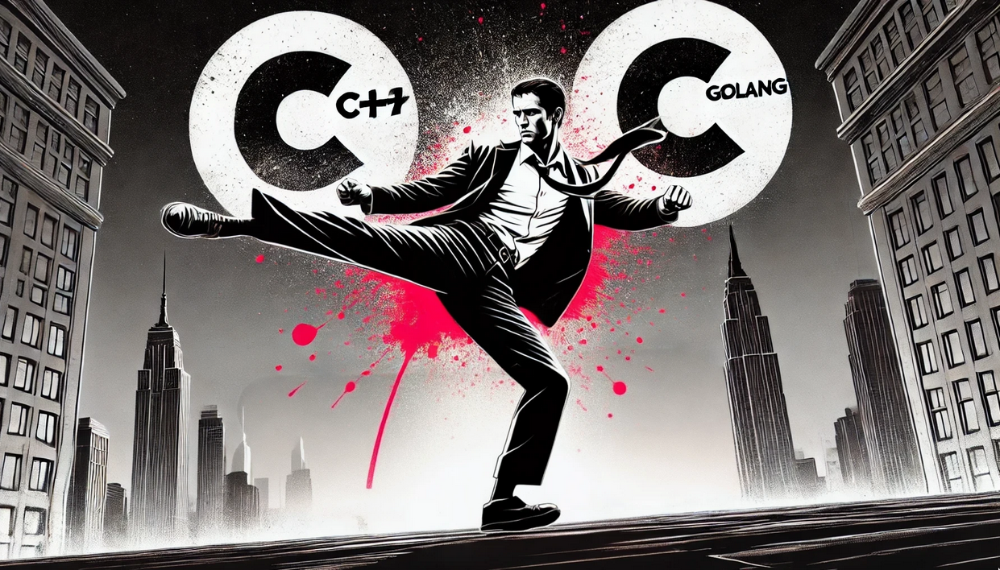

    

# Ivan Kurilla

 

**Senior C++ / Golang Software Engineer** with 7+ years of experience and a Computer Science background. Focused on **Backend development**, with additional expertise in **Embedded systems**, **Game development**, and **High-Frequency Trading (HFT)**. Skilled in mentoring on best practices and advanced techniques. Passionate about high-performance solutions and modern tech, with a keen interest in exploring new tools and languages through personal projects.

I am also
- ⌛ Pet project maker
- 🐧 Linux enthusiast
- 📷 Ex-photographer. My works still available at [500px](https://500px.com/p/vanyason?view=photos)
- 🎮 Indie gamer
- 🍿 Movie watcher
- ✈️ Traveler

# Expertise

- Main Languages: C++, Modern C++, C, Golang
- Working knowledge of : Python, Bash, Javascript, C#, Java, HTML, CSS
- Frameworks/Libraries : REST APIs, JSON-RPC, STL, BOOST, Make, CMake, ImGUI, Wails, Tailwind CSS, React
- Databases : SQL, SQLite, PostgreSQL, Oracle SQL, DBeaver
- Version Control : Git, GitLab, GitHub
- DevOps : Docker, CI/CD pipelines, Gitlab pipelines, Github Actions
- OS : Linux, Ubuntu, Windows 10-11, WSL, MacOS
- Design Principles and Patterns : Test Driven Development (TDD), Domain Driven Development (DDD), MVC, SOLID, DRY, KISS
- Work Management : Jira, Wrike, Slack, Microsoft Teams
- Other :  Multithreading, Memory Management, Agile Methodologies, Scrum,  Github Copilot, Cursor IDE...

# PERSONAL PROJECTS

- [Yeelight controller](https://github.com/vanyason/yeelight) - Golang-based cross-platform app for smart bulb control, deployed on Ubuntu, Windows, and macOS with CI/CD via GitHub Actions. Used personally for nearly a year with no bugs found during daily use
- **List.am Scraper**: Telegram bot (Golang, SQLite, Docker) for scraping rental listings on an Armenian platform, providing real-time market insights. Used during my emigration period
- **AI-Powered News/Media Scraper**: Ongoing project using Golang, PostgreSQL, and Docker to summarize events from media sources, leveraging concurrent processing for scalability

# Contact me

 